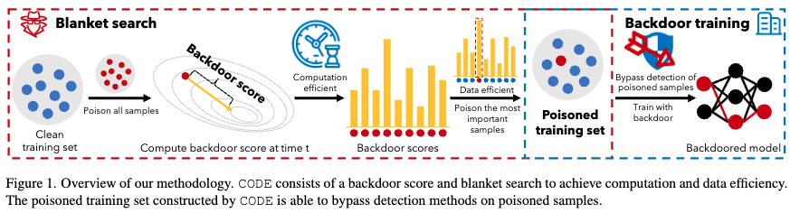
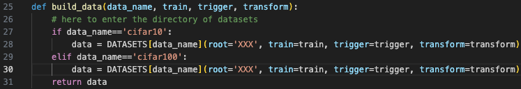
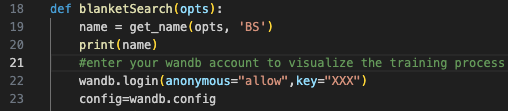
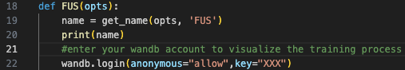

# CODE: Towards Computation and Data Efficient Backdoor Attacks on Deep Neural Networks

This is the code for paper *CODE: Towards Computation and Data Efficient Backdoor Attacks on Deep Neural Networks*.

## Overview of *CODE*

>ABSTRACT: Backdoor attacks have emerged as a prominent threat to deep neural networks (DNNs). 
By poisoning the training set, a backdoored DNN model will preserve its functionality on benign samples but misbehave over samples with a malicious trigger. 
Most backdoor research adopt a certain ratio of samples to poison with more stealthy designs like invisible triggers or clean-label attacks while ignoring the intrinsic distinction between samples. 
A few recent works try to achieve stealthiness by poisoning fewer samples that may bypass detection defense. 
They locate more critical samples considering the model training phase but have extensive extra computation costs. 
In this paper, we propose *CODE* that can achieve a critical sample locating to effectively inject backdoors with less sample poisoned (data efficient) with tiny extra computation costs (computation efficient). 
*CODE* consists of a specifically designed backdoor scoring method and a blanket searching method which is agnostic to trigger or label designs. 
First, we reveal that the critical samples for a successful backdoor are significantly different from those critical samples for model training.
Then, extensive experiments on both CV and NLP datasets prove that *CODE* can efficiently locate critical samples to achieve a good backdoor attack with fewer poison ratios. 

## System requirements
* Experiments done on a Linux server equipped with two Intel Xeon 2678 V3 CPUs and 10 NVIDIA GeForce RTX 3090 GPUs
* Work on Pytorch 1.x but faster on Pytorch 2.0, both with Python 3.8.0

## Playing with *CODE*

Install the required packages for python.

```bash
pip install -r requirements.txt
```

Put the path of datasets in **datasets/__init__.py**


Enter your wandb key for visualization of backdoor/benign training. 


Run **blanketSearch.py** for our method *CODE* (choose dataset with option *data_name*):
```bash
python blanketSearch.py --device 'cuda:0' --ratio 0.007 --score 'BAS' --data_name 'cifar10'
```
We can do ablation study by changing score to 'gradnorm':
```bash
python blanketSearch.py --device 'cuda:0' --ratio 0.007 --score 'gradnorm' --data_name 'cifar10'
```

Run **FUS.py** for baselines comparison:
* for FUS:
```bash
python FUS.py --device 'cuda:0' --ratio 0.007 --score 'forgettingscore' --data_name 'cifar10'
```
* for FUS + BAS:
```bash
python FUS.py --device 'cuda:0' --ratio 0.007 --score 'BAS' --data_name 'cifar10'
```

All results are saved in **res.json**.

